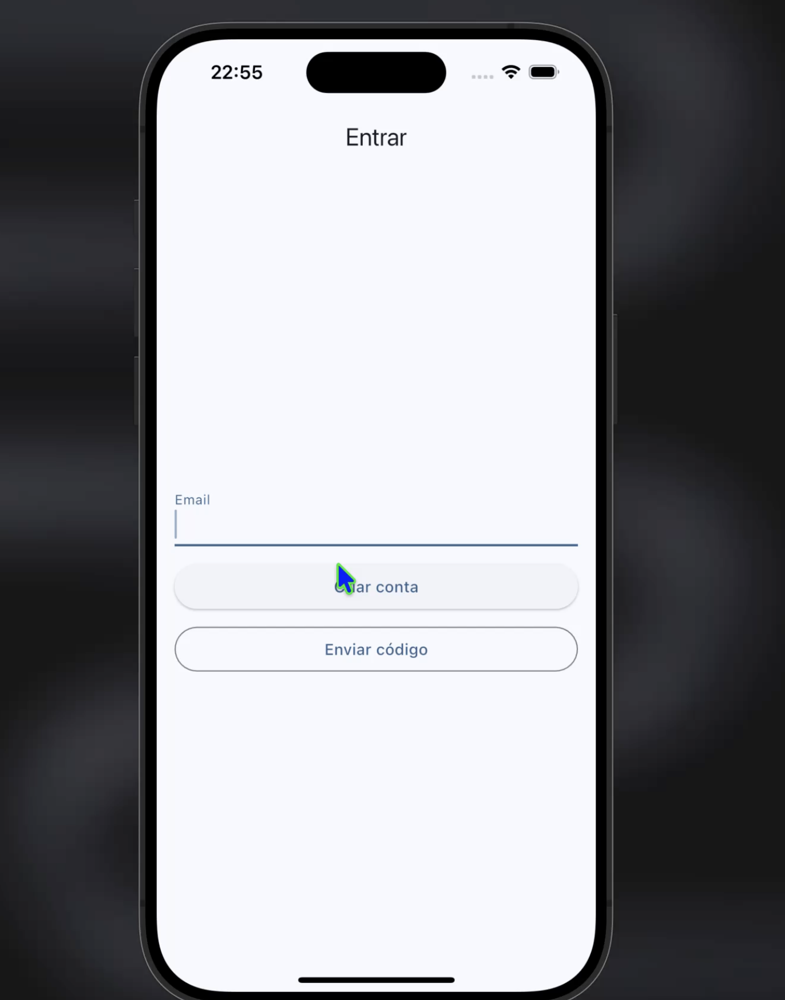

README GITHUB

<h1 align="center">
 PaivaFinance Mobile
</h1>

  <a href="#-tecnologias">Tecnologias</a>&nbsp;&nbsp;&nbsp;|&nbsp;&nbsp;&nbsp;
  <a href="#-projeto">Projeto</a>&nbsp;&nbsp;&nbsp;|&nbsp;&nbsp;&nbsp;

 

  

 

  
  
  
  
  

## 🚀 Tecnologias

Esse projeto foi desenvolvido com as seguintes tecnologias:

- Dart(Flutter)
- Nodejs(Express)
- JavaScript
- Git e GitHub

## 💻 Projeto

Já havia realizado esse projeto para web anteriormente, e dessa vez resolvir trazer ele para mobile também,
um projeto super legal e o marco do meu inicio em projetos mobiles.

Feito com ♥ by Rafael Paiva :wave:
